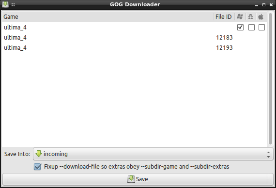
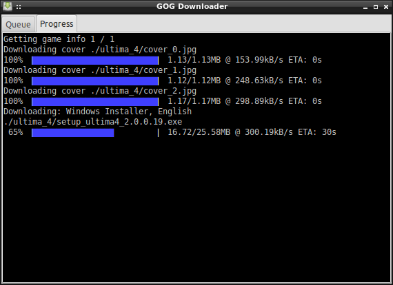
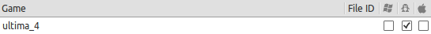
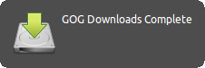
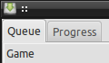

A simple GTK+ frontend for [LGOGDownloader](https://github.com/Sude-/lgogdownloader)
to enable support for the convenient `gogdownloader://` URIs that
[GOG.com](http://www.gog.com/) offers.

## Features

* Minimal but featureful queueing GUI designed for comfort and convenience

  

* Built-in terminal for lgogdownloader status without making your window
  manager sweat.

  

* Anything not configurable via the GUI will obey lgogdownloader's
  `config.cfg`.

  ```ini
language = 1
limit-rate = 300
no-targz = true
retries = 3
save-serials = true
  ```

* Remembers your preferred destination directory

  

* Support for selecting Linux downloads despite the site not offering
  `gogdownloader://` URIs for them

  

* Libnotify notification when all downloads are complete.

  

* Add, reorder, and delete remaining queue entries while a download is in
  progress. (Including changing the target directory for future downloads)

  

## Installation

```sh
# Get the dependencies
sudo apt-get install python-gtk2 python-dbus python-vte python-notify python-pip

# Unpack and install lgogd_uri
unzip lgogd_uri-master.zip
cd lgogd_uri-master
sudo pip install .    # Or `sudo ./setup.py install` if you don't need to uninstall

# Set it as your default handler for gogdownloader:// URIs
sudo update-desktop-database
xdg-mime default lgogd_uri.desktop x-scheme-handler/gogdownloader
```

This *should* make it work for both Firefox and Chrome, since both listen to
`xdg-mime default ...` but, depending on your version, you may need to restart
Firefox to get it to notice.

### Debugging:

If your browser still doesn't want to handle `gogdownloader://` links...

1. Run `xdg-open gogdownloader://ultima_4/installer_win_en` in a terminal.
   If that works, then your browser isn't obeying system defaults properly
   and your best bet is googling for questions about how to make BitTorrent
   magnet links work properly. (They use the same mechanism but are **much**
   more popular.)
2. Run `lgogd_uri gogdownloader://ultima_4/installer_win_en` in a terminal.
   If that works, but `xdg-open` doesn't, then it's installed but either the
   `lgogd_uri.desktop` file wasn't installed in the right place or the
   "Set it as your default handler" step failed.

## Uninstallation

    sudo pip uninstall lgogd_uri

## Known Shortcomings

* Providing the option to download Linux versions via the Windows or MacOS
  `gogdownloader://` URLs has resulted in the language-selection drop-down
  being ignored in favour of the `language` option in lgogdownloader's
  `config.cfg`
* Multi-selection doesn't get along with GTKTreeView's built-in drag-and-drop
  reordering and context-menu support. (Use the Delete key for batch deletion)
* Remembering un-finished downloads across a restart is still on the TODO list.
* Currently, no attempt is made to retrieve game metadata, so the "Game" and
  "File ID" columns don't give the nice, pretty output the official GOG
  downloader offers and the platform checkboxes will always start out set
  to the value of `platform` in your `config.cfg`.
* No attempt is currently made to deduplicate the queue, relying instead on
  LGOGDownloader to not redownload files which already exist.
* Fixup support for `--download-file` currently only resolves `%gamename%`

## License

[MIT](http://opensource.org/licenses/MIT) except for three easy-to-replace
platform logo icons copied from the GOG.com site theme.

* `windows.png`
* `linux.png`
* `mac.png`
